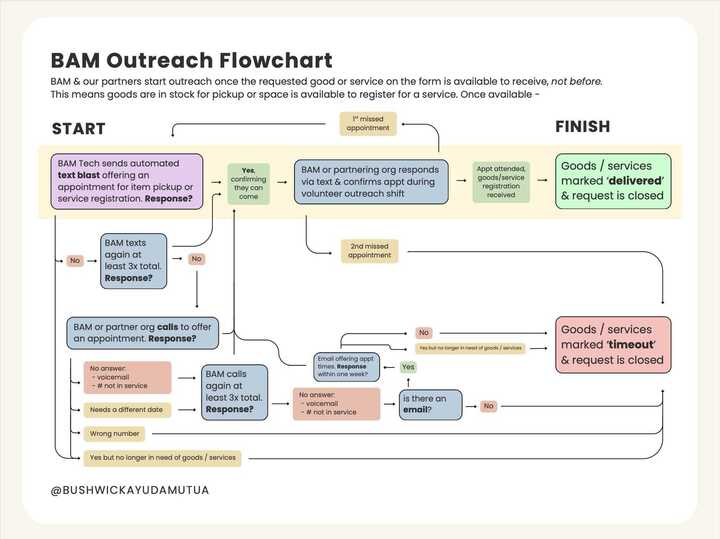
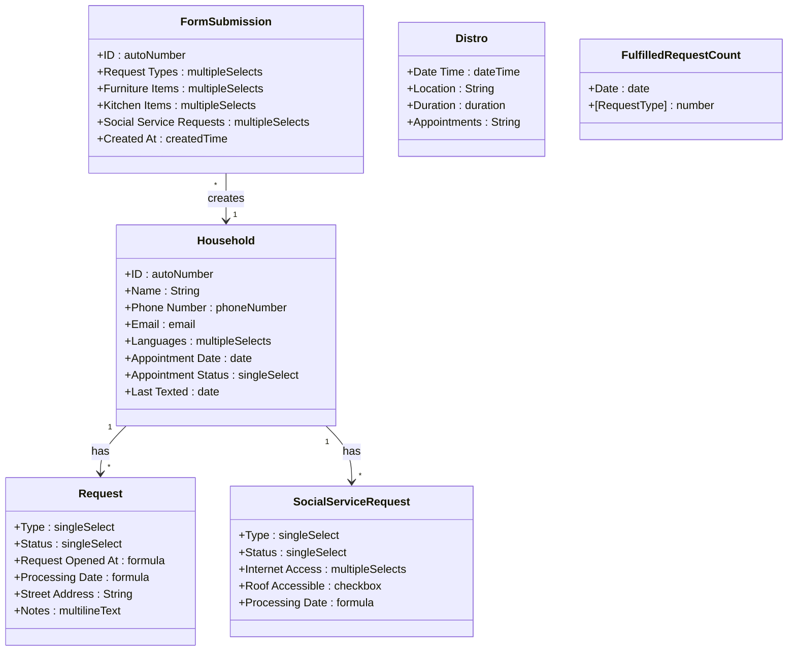
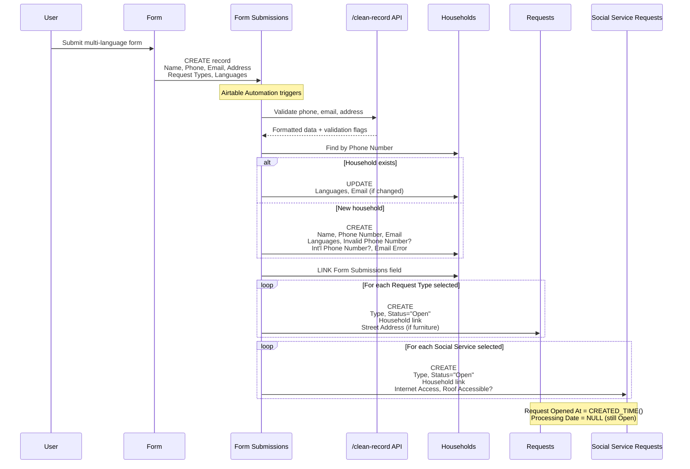
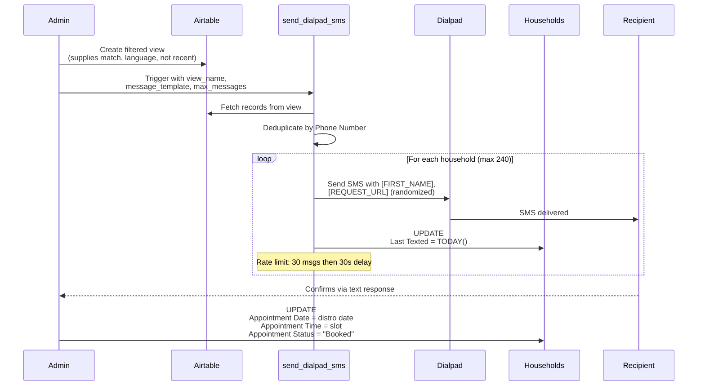
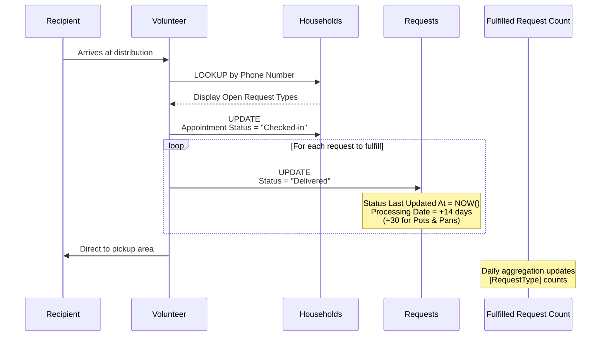
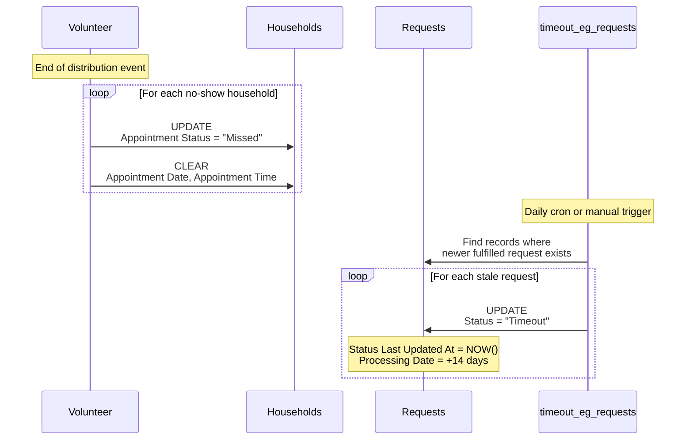
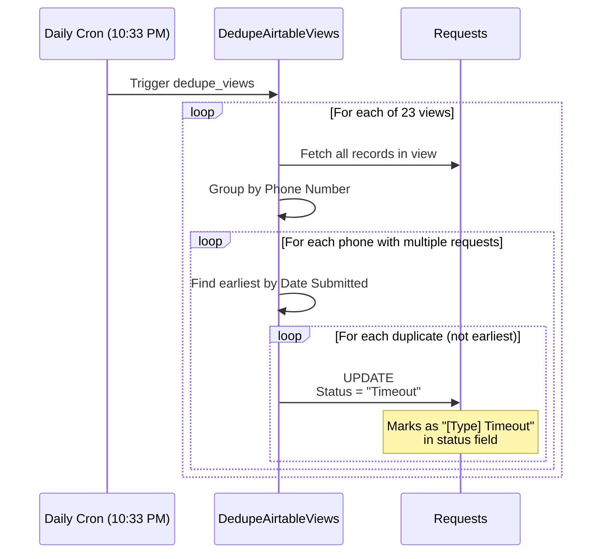
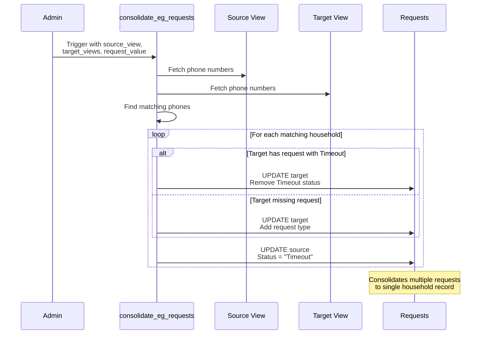
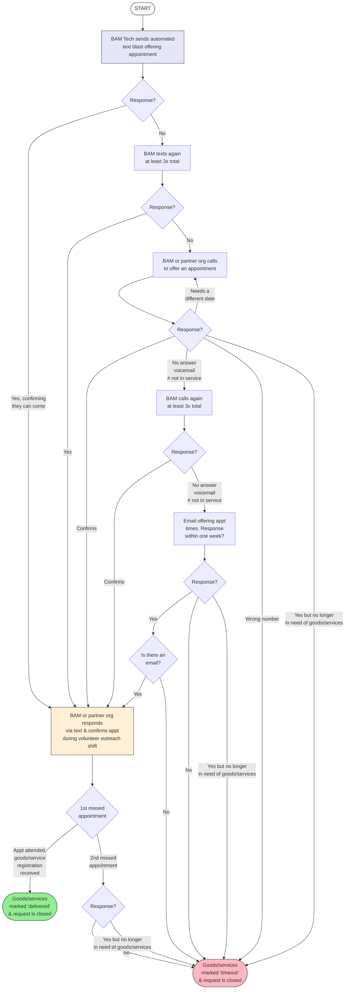

# BAM Mutual Aid System - Technical Specification

## 1. Background

### Problem Statement
Bushwick Ayuda Mutua (BAM) operates a mutual aid system that manages intake requests, distribution events, and volunteer coordination through a combination of Airtable, Digital Ocean functions, and manual processes. The current system has technical debt, relies on manual intervention for key workflows, and needs better data privacy practices.

### Context / History
- Existing system uses Airtable as primary database
- Automation functions hosted on Digital Ocean
- GitHub repo: bushwickayudamutua/bam-automation
- API docs: https://airtable.com/appjIo54Z8MWrqhlI/api/docs

### Existing Outreach Flowchart



*Current outreach process: automated text blasts, retry logic (3x text, then call, then email), timeout handling*

### Stakeholders
- **Recipients**: Community members requesting goods/services
- **Volunteers**: Outreach, check-in, delivery/transport, furniture teams
- **Admins**: System administrators managing distributions and data
- **External Systems**: Dialpad SMS, Airtable, Digital Ocean

---

## 2. Motivation

### Goals & Success Stories

**Recipient Journey:**
1. Submit request form (multi-language)
2. Receive text confirmation
3. Confirm appointment
4. Attend distribution event
5. Check in via phone number/name
6. Receive requested items
7. Re-request if needed

**Volunteer Goals:**
- Efficiently manage distribution outreach (text/phone)
- Check in recipients at events
- Track inventory post-distribution
- Coordinate furniture/delivery logistics

**System Goals:**
- Deduplicate requests automatically
- Maintain data privacy (hash sensitive data)
- Auto-expire stale requests (14 days standard, 30 days pots/pans)
- Track fulfilled vs outstanding requests
- Support 60 appointments per distribution (25% confirmation rate)

---

## 3. Scope and Approaches

### Non-Goals

| Technical Functionality | Reasoning | Tradeoffs |
|------------------------|-----------|-----------|
| Appointments & Distros tables | May be deprecated | Legacy data structure |
| Full automation of volunteer matching | Complex language/availability matching | Manual oversight still needed |
| Real-time inventory management | Informal post-distro reporting works | May miss accuracy |

### Value Proposition

| Technical Functionality | Value | Tradeoffs |
|------------------------|-------|-----------|
| Intake deduplication | Prevents duplicate requests per household | Phone number as unique ID may miss edge cases |
| Request auto-expiration | Keeps queue fresh and relevant | May lose valid long-term requests |
| Hashed PII storage | Privacy protection | Increases friction for address-based deliveries |
| Fulfilled requests anonymization | Data minimization | Loses granular historical data |

### Alternative Approaches

| Approach | Pros | Cons |
|----------|------|------|
| Raw PII storage | Easy lookups, low friction | Privacy risk, compliance issues |
| Full automation | Reduced manual work | Complex edge cases, less flexibility |
| Separate systems per workflow | Isolation, simpler components | Data silos, integration overhead |

### Relevant Metrics
- Fulfilled requests per type/volume
- Outstanding requests count
- Distribution attendance rate (~25% of outreach)
- Average 60 appointments per distribution
- 3 appointment-based distributions per week

---

## 4. Existing Automation Functions

The current system (bam-automation repo) includes these automated functions:

### Scheduled Jobs (Cron)

| Function | Schedule | Purpose |
|----------|----------|---------|
| `UpdateWebsiteRequestData` | Hourly | Publishes open request counts to website JSON |
| `DedupeAirtableViews` | Daily (10:33 PM ET) | Deduplicates records by phone across 23 views |
| `UpdateMailjetLists` | Daily | Syncs contacts to Mailjet email lists |
| `SnapshotAirtableViews` | Daily | Backs up modified records to S3 |

### Web-Triggered Functions

| Function | Purpose |
|----------|---------|
| `send_dialpad_sms` | Sends SMS text blasts via Dialpad API |
| `send_dialpad_sms` (V2) | SMS using new Household ORM model |
| `consolidate_eg_requests` | Consolidates requests when household needs multiple items |
| `timeout_eg_requests` | Times out old unfulfilled requests when newer ones fulfilled |
| `update_field_value` | Bulk updates field for multiple phone numbers |
| `/clean-record` API | Validates/normalizes phone, email, address |

### External Service Integrations

| Service | Purpose |
|---------|---------|
| Airtable | Primary database |
| Dialpad | SMS messaging |
| Mailjet | Email list management |
| Google Maps | Address normalization |
| NYC Planning Labs | Geospatial address lookup |
| Digital Ocean Spaces | File storage/CDN for snapshots |

### Request Type Categories

**Essential Goods:**
- Toiletries: Soap, Pads, Baby Diapers, Adult Diapers
- Household: Clothing, School Supplies, Stroller, Pet Food

**Kitchen Items:**
- Pots & Pans, Plates, Cups, Utensils, Microwave, Coffee Maker, Blender

**Furniture:**
- Beds (Crib through King, mattress/frame options)
- Sofa, Dresser, Desk, Coffee Table, Chairs, Storage, Dining Table, Fridge, AC

**Food Requests:**
- Groceries, Hot meals

**Social Services:**
- Housing, Health Insurance, English Classes, Transportation
- Tenant legal, In-school services, Tutoring, Business support
- Internet, Food benefits, Child disability, Pet assistance

### Multi-Language Support
All request names stored in trilingual format (Spanish/English/Chinese):
```
"Jabón & Productos de baño / Soap & Shower Products / 肥皂和淋浴用品"
```

### Supported Languages
- English, Spanish, Mandarin, Cantonese, Toishanese
- Quechua, Portuguese, Haitian Creole, Tagalog, Arabic, French

---

## 4.1 Airtable V2 Schema (New Base)

### Tables Overview

#### Households
Primary table for recipient households.

| Field | Type | Description |
|-------|------|-------------|
| Name | singleLineText | Household name |
| ID | autoNumber | Unique identifier |
| Phone Number | phoneNumber | Primary contact (unique key) |
| Invalid Phone Number? | checkbox | Validation flag |
| Int'l Phone Number? | checkbox | International number flag |
| Email | email | Contact email |
| Email Error | singleLineText | Validation error message |
| Languages | multipleSelects | Preferred languages |
| Notes | richText | Free-form notes |
| Requests | multipleRecordLinks | Link to Requests table |
| Open Request Types | multipleLookupValues | Lookup of open request types |
| Delivered Request Types | multipleLookupValues | Lookup of delivered types |
| Social Service Requests | multipleRecordLinks | Link to Social Service Requests |
| Open Social Service Request Types | multipleLookupValues | Lookup of open SS types |
| Created At | createdTime | Record creation time |
| Updated At | lastModifiedTime | Last modification time |
| Date of Oldest Fulfillable Request | rollup | Earliest open request date |
| Legacy First/Last Date Submitted | date | Migration fields |
| Form Submissions | multipleRecordLinks | Link to form submissions |
| Appointment Date | date | Scheduled appointment |
| Appointment Time | singleSelect | Time slot (11:00 AM, 11:30 AM) |
| Appointment Status | singleSelect | Booked/Checked-in/Missed |
| Last Texted | date | Last SMS outreach date |

#### Requests
Individual goods/service requests linked to households.

| Field | Type | Description |
|-------|------|-------------|
| Label | formula | Display label (from Type) |
| Type | singleSelect | Request type (trilingual) |
| Household | multipleRecordLinks | Link to Households |
| Status | singleSelect | Open/Timeout/Delivered |
| Notes | multilineText | Request-specific notes |
| Updated At | lastModifiedTime | Last modification |
| Status Last Updated At | lastModifiedTime | When status changed |
| Legacy Date Submitted | date | Migration field |
| Request Opened At | formula | Effective open date |
| Processing Date | formula | Auto-calculated expiry (14/30 days) |
| Street Address | singleLineText | Delivery address |
| City, State | singleLineText | Location |
| Zip Code | number | Postal code |
| Geocode | singleLineText | Geo coordinates |
| Address | singleLineText | Formatted address |
| Phone Number (from Household) | multipleLookupValues | Lookup |
| Last texted (from Household) | multipleLookupValues | Lookup |

**Processing Date Formula:**
- Status changed to Delivered: +14 days (or +30 for Pots & Pans)
- Status changed to Timeout: +14 days

#### Social Service Requests
Separate table for social services (different from goods).

| Field | Type | Description |
|-------|------|-------------|
| Label | formula | Display label |
| Phone Number (from Household) | multipleLookupValues | Contact lookup |
| Type | singleSelect | Service type (12 options) |
| Status | singleSelect | Open/Timeout/Delivered |
| Household | multipleRecordLinks | Link to Households |
| Internet Access | multipleSelects | Current internet situation |
| Roof Accessible? | checkbox | For internet installation |
| Address fields | various | Location data |
| Status Last Updated At | lastModifiedTime | Status change time |
| Notes | multilineText | Service notes |
| Request Opened At | formula | Effective open date |
| Processing Date | formula | +14 days after status change |

#### Distros
Distribution event tracking.

| Field | Type | Description |
|-------|------|-------------|
| Date & Time | dateTime | Event date/time |
| Location | singleLineText | Venue |
| Duration | duration | Event length |
| Appointments | singleLineText | Appointment count/details |
| Notes | multilineText | Event notes |

#### Fulfilled Request Count
Aggregated metrics per date.

| Field | Type | Description |
|-------|------|-------------|
| Date | date | Reporting date |
| [Request Type] | number | Count per type (50+ columns) |

Tracks all request types: Groceries, Diapers, Furniture, Kitchen, Social Services, etc.

#### Assistance Request Form Submissions
Raw form intake data.

| Field | Type | Description |
|-------|------|-------------|
| ID | autoNumber | Submission ID |
| Name | singleLineText | Requestor name |
| Address fields | various | Location data |
| Phone Number | phoneNumber | Contact |
| Email | email | Contact |
| Languages | multipleSelects | Preferred languages |
| Request Types | multipleSelects | Goods requested |
| Furniture Items | multipleSelects | Furniture specifics |
| Bed Details | multipleSelects | Bed size/type |
| Furniture Acknowledgement | checkbox | Terms accepted |
| Kitchen Items | multipleSelects | Kitchen specifics |
| Social Service Requests | multipleSelects | Services needed |
| Internet Access | multipleSelects | Current situation |
| Roof Accessible? | checkbox | For internet |
| Notes | richText | Additional info |
| Created At | createdTime | Submission time |
| Households | multipleRecordLinks | Link to created household |

### Request Status Values
- **Open**: Active, awaiting fulfillment
- **Timeout**: Expired or no response
- **Delivered**: Fulfilled

### Appointment Status Values
- **Booked**: Confirmed for distribution
- **Checked-in**: Attended, checking in
- **Missed**: No-show

---

## 5. Step-by-Step Flows

### 5.1 Intake Processing (Happy Path)

**Pre-condition:** Form submission received in Intake Table

1. **User** submits multi-language conditional intake form
2. **System** validates and stores all fields in Intake Table
3. **System** applies filters and creates Household row
4. **System** creates Request rows per request type
5. **System** applies deduplication logic (phone number key)
6. **System** normalizes data and stores hash of PII
7. **System** deletes Intake Table row
8. **System** schedules auto-expiration (14/30 days)

**Post-condition:** Household and Request records exist; Intake cleared

---

### 5.2 Distribution Outreach Flow (Happy Path)

**Pre-condition:** Distribution scheduled, inventory checked

1. **Admin** creates filtered view matching target population criteria:
   - Available supplies match
   - Language availability at distro
   - Not recently attended
2. **System** (Digital Ocean) processes view via `/send_dialpad_sms`
3. **System** sends text blast with language-specific templates
4. **Recipients** respond to confirm (target: 240 people for 60 appointments)
5. **Volunteer** manually marks confirmations in Airtable
6. **Recipients** attend distribution

**Post-condition:** Appointments confirmed, ready for check-in

---

### 5.3 Check-In Flow (Happy Path)

**Pre-condition:** Recipient confirmed appointment

1. **Recipient** arrives at distribution
2. **Volunteer** performs phone number lookup in Airtable
3. **System** displays recipient's requests
4. **Volunteer** marks requests as fulfilled
5. **Volunteer** directs recipient to pickup area
6. **System** anonymizes and moves to fulfilled requests view

**Post-condition:** Request closed, anonymized record created

---

### 5.4 Alternate / Error Paths

| # | Condition | System Action | Suggested Handling |
|---|-----------|---------------|-------------------|
| A1 | Duplicate phone number | Skip duplicate request | Log and notify admin |
| A2 | Partial fulfillment (out of stock) | Keep request open | Do not mark as fulfilled to prevent deprioritization |
| A3 | No-show at appointment | Mark as missed | Return to queue for next outreach cycle |
| A4 | 1st missed appointment | Continue in queue | Follow outreach flowchart retry logic |
| A5 | 2nd missed appointment | Email if available | Attempt email contact |
| A6 | No response after all attempts | Mark as timeout | Close request |
| A7 | Wrong number | Mark as invalid | Close request |
| A8 | No longer needs goods | Mark complete | Close request |

---

## 6. UML Diagrams

### Entity Relationships



### Intake Processing Sequence



### Distribution Outreach Sequence



### Check-In Flow Sequence



### No-Show / Timeout Sequence



### Request Deduplication Sequence



### Request Consolidation Sequence



### Outreach Flowchart (Mermaid)



---

## 7. Edge Cases and Concessions

### Data Privacy
- **Concession**: Addresses stored in plain text for furniture/delivery requests (hashing would break logistics)
- **Edge case**: Multiple households sharing same phone number - may cause deduplication issues
- **Edge case**: Multiple phone numbers per household - may create duplicate households

### Request Expiration
- **Concession**: 14-day window may be too short for some needs
- **Exception**: Pots/pans get 30-day window due to availability constraints

### Outreach
- **Concession**: Text blast targeting is not fully automated - requires manual view creation
- **Edge case**: Language matching between volunteers and recipients is manual

### Fulfillment
- **Design decision**: Partial fulfillment keeps request open to prevent deprioritization
- **Concession**: Post-distro inventory is informal text-based reporting

---

## 8. Open Questions

1. **PII Hashing**: How to handle address obfuscation without breaking delivery/pickup workflows?
2. **Volunteer Access**: What is the access revocation timeline and process?
3. **Furniture Team Flow**: Need detailed workflow from furniture team (currently not taking new requests)
4. **Phone Call Outreach**: Need to research and document single-person phone outreach flow
5. **Admin Flows**: Need to interview admins to document administrative workflows
6. **Cron Jobs**: Review Digital Ocean cron jobs for technical debt assessment

---

## 9. Glossary / References

### Terms
- **BAM** - Bushwick Ayuda Mutua
- **Distro** - Distribution event where recipients pick up goods
- **Intake** - Initial request submission from community members
- **Text Blast** - Automated SMS outreach to target population
- **Timeout** - Request closed due to no response after all contact attempts

### Request Types
- Diapers (sizes 1-6)
- Pads/Tampons/Panty liners
- Soap
- School supplies
- Masks/COVID tests
- Kitchen supplies
- Furniture (separate flow)
- Pots and pans (30-day expiry)

### Links
- Airtable API: https://airtable.com/appjIo54Z8MWrqhlI/api/docs
- Automation repo: https://github.com/bushwickayudamutua/bam-automation
- Entry point: `functions/project.yml`
- SMS endpoint: `/send_dialpad_sms`
