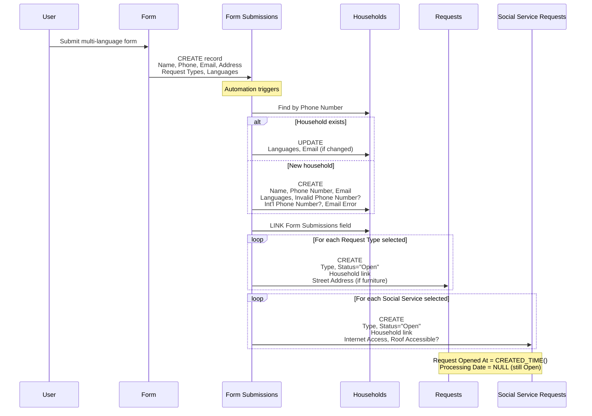
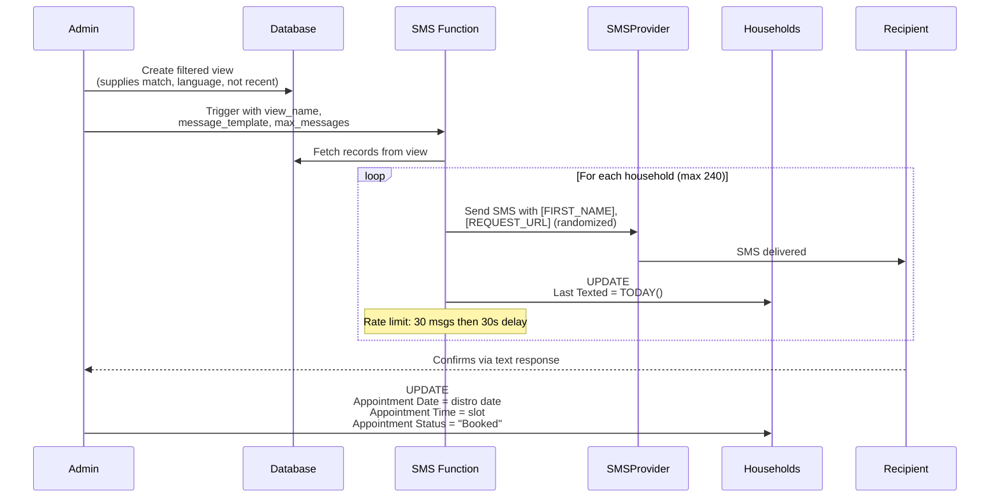
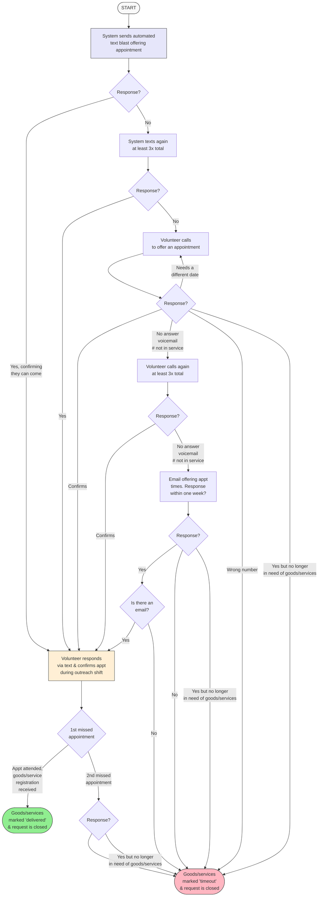
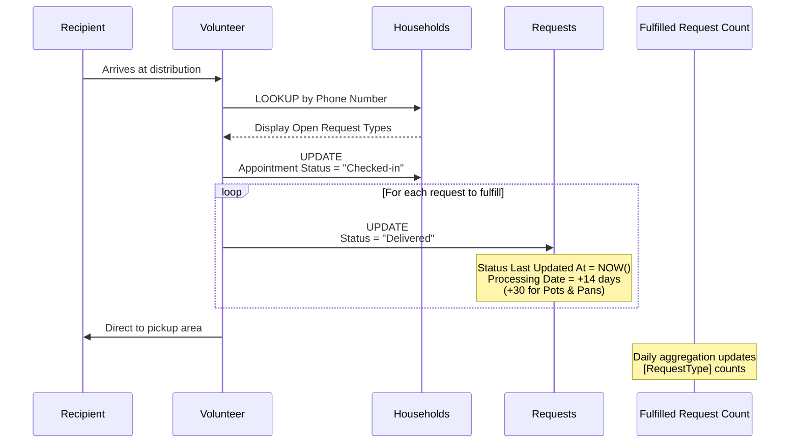
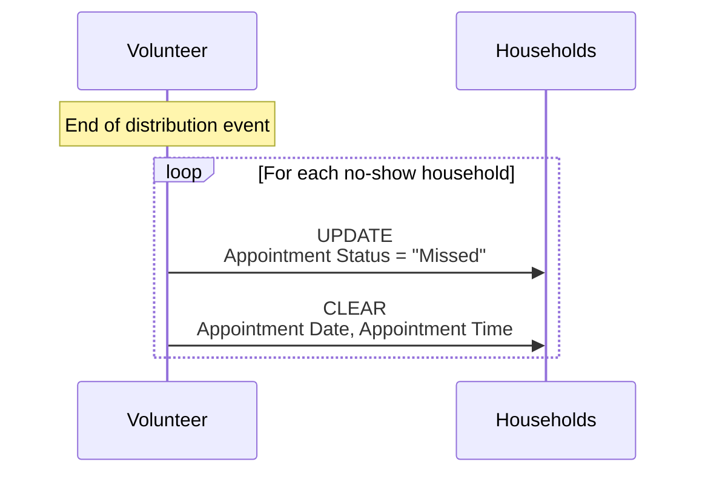

# BAM Mutual Aid System V2 - Technical Specification

## 1. Background

### Problem Statement
The current BAM mutual aid system has technical debt, relies on manual intervention for key workflows, and needs better data privacy practices. This specification defines the improved V2 system that addresses these issues while maintaining all existing functionality.

### Reference Documents
- **Current System Documentation:** [background-current-system.md](./background-current-system.md)
- **Existing Outreach Flowchart:** [bam-outreach-flowchart.png](./bam-outreach-flowchart.png)

### Stakeholders
- **Recipients**: Community members requesting goods/services
- **Volunteers**: Outreach, check-in, delivery/transport, furniture teams
- **Admins**: System administrators managing distributions and data
- **External Systems**: SMS provider, Database, Automation platform

---

## 2. Motivation

### Goals & Success Stories

**Recipient Journey:**
1. Submit request form (multi-language)
2. Receive text confirmation
3. Confirm appointment
4. Attend distribution event
5. Check in via phone number/name
6. Receive requested items
7. Re-request if needed

**Volunteer Goals:**
- Efficiently manage distribution outreach (text/phone)
- Check in recipients at events
- Track inventory post-distribution
- Coordinate furniture/delivery logistics

**System Goals:**
- Deduplicate requests automatically
- Maintain data privacy (hash sensitive data)
- Auto-expire stale requests (14 days standard, 30 days pots/pans)
- Track fulfilled vs outstanding requests
- Support 60 appointments per distribution (25% confirmation rate)

---

## 3. Scope and Approaches

### Non-Goals

| Technical Functionality | Reasoning | Tradeoffs |
|------------------------|-----------|-----------|
| Full automation of volunteer matching | Complex language/availability matching | Manual oversight still needed |
| Real-time inventory management | Informal post-distro reporting works | May miss accuracy |
| Automated language detection | Recipient knows best | Self-selection more reliable |

### Value Proposition

| Technical Functionality | Value | Tradeoffs |
|------------------------|-------|-----------|
| Request auto-expiration | Keeps queue fresh and relevant | May lose valid long-term requests |
| Automated outreach retry logic | Consistent follow-up process | Requires 3x text, call, email sequence |

### Alternative Approaches

| Approach | Pros | Cons |
|----------|------|------|
| Full automation | Reduced manual work | Complex edge cases, less flexibility |
| Separate systems per workflow | Isolation, simpler components | Data silos, integration overhead |

### Relevant Metrics
- Fulfilled requests per type/volume
- Outstanding requests count
- Distribution attendance rate (~25% of outreach)
- Average 60 appointments per distribution
- 3 appointment-based distributions per week

---

## 4. Data Schema

### Tables Overview

#### Households
Primary table for recipient households.

| Field | Type | Description |
|-------|------|-------------|
| Name | singleLineText | Household name |
| ID | autoNumber | Unique identifier |
| Phone Number | phoneNumber | Primary contact (unique key) |
| Invalid Phone Number? | checkbox | Validation flag |
| Int'l Phone Number? | checkbox | International number flag |
| Email | email | Contact email |
| Email Error | singleLineText | Validation error message |
| Languages | multipleSelects | Preferred languages |
| Notes | richText | Free-form notes |
| Requests | multipleRecordLinks | Link to Requests table |
| Open Request Types | multipleLookupValues | Lookup of open request types |
| Delivered Request Types | multipleLookupValues | Lookup of delivered types |
| Social Service Requests | multipleRecordLinks | Link to Social Service Requests |
| Open Social Service Request Types | multipleLookupValues | Lookup of open SS types |
| Created At | createdTime | Record creation time |
| Updated At | lastModifiedTime | Last modification time |
| Date of Oldest Fulfillable Request | rollup | Earliest open request date |
| Legacy First/Last Date Submitted | date | Migration fields |
| Form Submissions | multipleRecordLinks | Link to form submissions |
| Appointment Date | date | Scheduled appointment |
| Appointment Time | singleSelect | Time slot (11:00 AM, 11:30 AM) |
| Appointment Status | singleSelect | Booked/Checked-in/Missed |
| Last Texted | date | Last SMS outreach date |

#### Requests
Individual goods/service requests linked to households.

| Field | Type | Description |
|-------|------|-------------|
| Label | formula | Display label (from Type) |
| Type | singleSelect | Request type (trilingual) |
| Household | multipleRecordLinks | Link to Households |
| Status | singleSelect | Open/Timeout/Delivered |
| Notes | multilineText | Request-specific notes |
| Updated At | lastModifiedTime | Last modification |
| Status Last Updated At | lastModifiedTime | When status changed |
| Legacy Date Submitted | date | Migration field |
| Request Opened At | formula | Effective open date |
| Processing Date | formula | Auto-calculated expiry (14/30 days) |
| Street Address | singleLineText | Delivery address |
| City, State | singleLineText | Location |
| Zip Code | number | Postal code |
| Geocode | singleLineText | Geo coordinates |
| Address | singleLineText | Formatted address |
| Phone Number (from Household) | multipleLookupValues | Lookup |
| Last texted (from Household) | multipleLookupValues | Lookup |

**Processing Date Formula:**
- Status changed to Delivered: +14 days (or +30 for Pots & Pans)
- Status changed to Timeout: +14 days

#### Social Service Requests
Separate table for social services (different from goods).

| Field | Type | Description |
|-------|------|-------------|
| Label | formula | Display label |
| Phone Number (from Household) | multipleLookupValues | Contact lookup |
| Type | singleSelect | Service type (12 options) |
| Status | singleSelect | Open/Timeout/Delivered |
| Household | multipleRecordLinks | Link to Households |
| Internet Access | multipleSelects | Current internet situation |
| Roof Accessible? | checkbox | For internet installation |
| Address fields | various | Location data |
| Status Last Updated At | lastModifiedTime | Status change time |
| Notes | multilineText | Service notes |
| Request Opened At | formula | Effective open date |
| Processing Date | formula | +14 days after status change |

#### Distros
Distribution event tracking.

| Field | Type | Description |
|-------|------|-------------|
| Date & Time | dateTime | Event date/time |
| Location | singleLineText | Venue |
| Duration | duration | Event length |
| Appointments | singleLineText | Appointment count/details |
| Notes | multilineText | Event notes |

#### Fulfilled Request Count
Aggregated metrics per date.

| Field | Type | Description |
|-------|------|-------------|
| Date | date | Reporting date |
| [Request Type] | number | Count per type (50+ columns) |

#### Assistance Request Form Submissions
Raw form intake data.

| Field | Type | Description |
|-------|------|-------------|
| ID | autoNumber | Submission ID |
| Name | singleLineText | Requestor name |
| Address fields | various | Location data |
| Phone Number | phoneNumber | Contact |
| Email | email | Contact |
| Languages | multipleSelects | Preferred languages |
| Request Types | multipleSelects | Goods requested |
| Furniture Items | multipleSelects | Furniture specifics |
| Bed Details | multipleSelects | Bed size/type |
| Furniture Acknowledgement | checkbox | Terms accepted |
| Kitchen Items | multipleSelects | Kitchen specifics |
| Social Service Requests | multipleSelects | Services needed |
| Internet Access | multipleSelects | Current situation |
| Roof Accessible? | checkbox | For internet |
| Notes | richText | Additional info |
| Created At | createdTime | Submission time |
| Households | multipleRecordLinks | Link to created household |

### Status Values

**Request Status:**
- **Open**: Active, awaiting fulfillment
- **Timeout**: Expired or no response
- **Delivered**: Fulfilled

**Appointment Status:**
- **Booked**: Confirmed for distribution
- **Checked-in**: Attended, checking in
- **Missed**: No-show

---

## 5. System Functions

### Scheduled Jobs (Cron)

| Function | Schedule | Purpose |
|----------|----------|---------|
| `UpdateWebsiteRequestData` | Hourly | Publishes open request counts to website JSON |

### Web-Triggered Functions

| Function | Purpose |
|----------|---------|
| `send_sms` | Sends SMS text blasts |

---

## 6. Step-by-Step Flows

### 6.1 Intake Processing (Happy Path)

**Pre-condition:** Form submission received in Intake Table

1. **User** submits multi-language conditional intake form
2. **System** validates and stores all fields in Intake Table
3. **System** applies filters and creates Household row
4. **System** creates Request rows per request type
5. **System** normalizes data
6. **System** deletes Intake Table row
7. **System** schedules auto-expiration (14/30 days)

**Post-condition:** Household and Request records exist; Intake cleared

#### Sequence Diagram



---

### 6.2 Distribution Outreach Flow (Happy Path)

**Pre-condition:** Distribution scheduled, inventory checked

1. **Admin** creates filtered view matching target population criteria:
   - Available supplies match
   - Language availability at distro
   - Not recently attended
2. **System** processes view via SMS function
3. **System** sends text blast with language-specific templates
4. **Recipients** respond to confirm (target: 240 people for 60 appointments)
5. **Volunteer** manually marks confirmations
6. **Recipients** attend distribution

**Post-condition:** Appointments confirmed, ready for check-in

#### Sequence Diagram



#### Outreach Flowchart



---

### 6.3 Check-In Flow (Happy Path)

**Pre-condition:** Recipient confirmed appointment

1. **Recipient** arrives at distribution
2. **Volunteer** performs phone number lookup
3. **System** displays recipient's requests
4. **Volunteer** marks requests as fulfilled
5. **Volunteer** directs recipient to pickup area

**Post-condition:** Request closed

#### Sequence Diagram



#### No-Show Sequence



---

### 6.4 Delivery / Transport Flow

**Pre-condition:** Items need to be transported between locations

1. **Coordinator** sends message to BAM group requesting transport help
2. **Volunteer** shows up at pickup location with vehicle
3. **Team** loads items into vehicle
4. **Volunteer** drives to destination
5. **Team** unloads items at destination

**Post-condition:** Items transported to destination

**Note:** This flow is primarily text-based coordination through group messaging.

---

### 6.5 Donate / Volunteer Flow

**Pre-condition:** Community member wants to donate or volunteer

1. **User** submits donate/volunteer form
2. **System** records submission
3. **Admin** reviews and follows up as needed

**Post-condition:** Donation/volunteer interest recorded

**Note:** Furniture donations have a separate flow handled by the furniture team.

---

### 6.6 Post-Distro Inventory Flow

**Pre-condition:** Distribution event completed

1. **Volunteer** takes inventory of remaining supplies
2. **Volunteer** sends inventory report to group (text-based)
3. **Admin** reviews inventory levels for next distro planning

**Post-condition:** Inventory levels communicated to team

**Example Report Format:**
```
POST DISTRO INVENTORY [DATE]
Basement inventory:
Buyer: [Name]
Inventory: [Name]

Diapers:
1: X boxes
2: X boxes
...

Pads: X packs
Soap: X boxes
School Supplies: X boxes
Kitchen: description
```

---

### 6.7 Alternate / Error Paths

| # | Condition | System Action | Suggested Handling |
|---|-----------|---------------|-------------------|
| A1 | Partial fulfillment (out of stock) | Keep request open | Do not mark as fulfilled to prevent deprioritization |
| A2 | No-show at appointment | Mark as missed | Return to queue for next outreach cycle |
| A3 | 1st missed appointment | Continue in queue | Follow outreach flowchart retry logic |
| A4 | 2nd missed appointment | Email if available | Attempt email contact |
| A5 | No response after all attempts | Mark as timeout | Close request |
| A6 | Wrong number | Mark as invalid | Close request |
| A7 | No longer needs goods | Mark complete | Close request |

---

## 7. Edge Cases and Concessions

### Data
- **Edge case**: Multiple households sharing same phone number
- **Edge case**: Multiple phone numbers per household - may create duplicate households

### Request Expiration
- **Concession**: 14-day window may be too short for some needs
- **Exception**: Pots/pans get 30-day window due to availability constraints

### Outreach
- **Concession**: Text blast targeting is not fully automated - requires manual view creation
- **Edge case**: Language matching between volunteers and recipients is manual

### Fulfillment
- **Design decision**: Partial fulfillment keeps request open to prevent deprioritization
- **Concession**: Post-distro inventory is informal text-based reporting

---

## 8. Open Questions

1. **Volunteer Access**: What is the access revocation timeline and process?
2. **Furniture Team Flow**: Need detailed workflow from furniture team (currently not taking new requests)
3. **Phone Call Outreach**: Need to research and document single-person phone outreach flow
4. **Admin Flows**: Need to interview admins to document administrative workflows
5. **Cron Jobs**: Review automation jobs for technical debt assessment

---

## 9. Feature Suggestions

The following features could improve system efficiency, user experience, and operational scalability. These are suggestions for future consideration, not requirements for the current V2 implementation.

### 9.1 Automation & Efficiency

#### Automated Outreach Targeting
**Problem:** Admins manually create filtered views for each text blast.
**Suggestion:** Auto-generate target lists based on:
- Current inventory levels
- Volunteer language availability for upcoming distro
- Recipients who haven't attended in X days
- Request age prioritization

**Value:** Reduces admin prep time, ensures consistent targeting criteria, minimizes human error.

#### Automated Appointment Booking
**Problem:** Volunteers manually respond to each confirmation and update Airtable.
**Suggestion:** Self-service booking system where recipients:
- Receive text with available time slots
- Reply with slot number to auto-book
- Get confirmation with appointment details

**Value:** Reduces volunteer workload during outreach shifts, faster booking turnaround.

#### Smart Follow-Up Sequences
**Problem:** 3x text, 3x call, email sequence requires manual tracking.
**Suggestion:** Automated escalation workflow:
- Auto-send follow-up texts on schedule
- Flag for phone call after text failures
- Auto-email after call failures
- Track attempts per household

**Value:** Consistent follow-up without volunteer tracking burden.

#### Language-Aware Routing
**Problem:** Manual matching of volunteer languages to recipient needs.
**Suggestion:** System matches:
- Volunteer language skills to recipient preferences
- Auto-assign outreach based on language match
- Alert when no language match available

**Value:** Better recipient experience, more efficient volunteer utilization.

---

### 9.2 Inventory Management

#### Real-Time Inventory Tracking
**Problem:** Post-distro inventory is informal text reporting.
**Suggestion:** Digital inventory system with:
- Pre-distro stock counts
- Real-time deduction during check-in
- Low-stock alerts
- Reorder suggestions

**Value:** Better distro planning, prevents over-promising items not in stock.

#### Inventory-Aware Request Matching
**Problem:** Admins manually match available supplies to request types.
**Suggestion:** System auto-filters outreach to:
- Only contact households requesting available items
- Prioritize items with excess inventory
- Defer low-stock item requests

**Value:** Higher fulfillment rate per distro, reduces partial fulfillments.

---

### 9.3 Recipient Experience

#### Request Status Portal
**Problem:** Recipients have no visibility into request status.
**Suggestion:** Simple web/SMS interface showing:
- Current request status (Open/Scheduled/Fulfilled)
- Position in queue
- Estimated wait time
- Next distro dates

**Value:** Reduces inquiry volume, builds trust through transparency.

#### Appointment Reminders
**Problem:** No automated reminders before appointments.
**Suggestion:** Send reminders:
- 24 hours before appointment
- 2 hours before appointment
- Include location, time, what to bring

**Value:** Reduces no-show rate, improves distro efficiency.

#### Multi-Channel Notifications
**Problem:** SMS-only communication limits reach.
**Suggestion:** Support multiple channels:
- SMS (primary)
- Email (backup)
- WhatsApp (for international numbers)
- Push notifications (future app)

**Value:** Better reach, accommodates communication preferences.

#### Configurable Expiration Windows
**Problem:** Fixed 14-day expiration may not suit all request types.
**Suggestion:** Per-request-type expiration:
- Urgent items (diapers, pads): 7 days
- Standard goods: 14 days
- Furniture/large items: 30-60 days
- Social services: 30 days

**Value:** Better matches urgency to item availability patterns.

---

### 9.4 Volunteer Management

#### Shift Scheduling System
**Problem:** Manual coordination for distro staffing.
**Suggestion:** Volunteer scheduling with:
- Available shift slots per distro
- Self-service sign-up
- Language skill matching
- Automated reminders
- No-show tracking

**Value:** Easier coordination, better language coverage.

#### Volunteer Onboarding Workflow
**Problem:** Onboarding process unclear.
**Suggestion:** Structured onboarding:
- Automated welcome sequence
- Training module completion tracking
- Shadowing assignment
- Probation period management
- Skill certification

**Value:** Consistent onboarding, faster time-to-productivity.

#### Access Management
**Problem:** Volunteer access revocation timeline unclear.
**Suggestion:** Automated access lifecycle:
- Inactivity alerts (30/60/90 days)
- Auto-revoke after X days inactive
- Re-onboarding for returning volunteers
- Audit trail for access changes

**Value:** Security, compliance, clean volunteer roster.

---

### 9.5 Data Quality & Privacy

#### Phone Number Validation
**Problem:** Invalid/international numbers cause outreach failures.
**Suggestion:** At intake:
- Format validation
- Carrier lookup
- International number flagging
- Duplicate detection

**Value:** Cleaner data, fewer failed outreach attempts.

#### Household Deduplication Tools
**Problem:** Multiple phone numbers create duplicate households.
**Suggestion:** Admin tools for:
- Duplicate detection reports
- Merge household records
- Link multiple phones to one household
- Audit trail for merges

**Value:** Accurate household counts, prevents double-fulfillment.

#### Configurable Data Retention
**Problem:** No clear policy for old data.
**Suggestion:** Automated data lifecycle:
- Archive fulfilled requests after X days
- Anonymize PII after retention period
- Configurable per data type
- Compliance reporting

**Value:** Privacy compliance, database performance.

---

### 9.6 Reporting & Analytics

#### Operations Dashboard
**Problem:** Metrics require manual aggregation.
**Suggestion:** Real-time dashboard showing:
- Open requests by type
- Fulfillment rate trends
- No-show rates
- Inventory levels
- Volunteer activity

**Value:** Data-driven decisions, early problem detection.

#### Distribution Planning Reports
**Problem:** Manual analysis for distro planning.
**Suggestion:** Auto-generated reports:
- Optimal target list size for capacity
- Language coverage gaps
- Geographic distribution
- Historical attendance patterns

**Value:** Better planning, improved efficiency.

#### Impact Reporting
**Problem:** Limited visibility into program impact.
**Suggestion:** Generate reports for:
- Households served over time
- Requests fulfilled by type
- Average time-to-fulfillment
- Community reach by neighborhood

**Value:** Fundraising support, stakeholder communication.

---

### 9.7 Integration & Infrastructure

#### API for External Systems
**Problem:** Limited integration capabilities.
**Suggestion:** REST API supporting:
- Read/write for all tables
- Webhook subscriptions
- Rate limiting
- Authentication/authorization

**Value:** Enables partner integrations, custom tooling.

#### Mobile Check-In App
**Problem:** Airtable interface not optimized for mobile.
**Suggestion:** Dedicated mobile app for:
- Phone number lookup
- Request display
- Quick fulfillment marking
- Offline support

**Value:** Faster check-ins, works in low-connectivity venues.

#### Backup & Disaster Recovery
**Problem:** Single point of failure in current system.
**Suggestion:** Implement:
- Daily automated backups
- Point-in-time recovery
- Failover procedures
- Recovery testing schedule

**Value:** Data protection, operational continuity.

---

### 9.8 Priority Recommendations

Based on impact and feasibility, suggested implementation priority:

| Priority | Feature | Impact | Effort |
|----------|---------|--------|--------|
| **P0** | Appointment Reminders | High - reduces no-shows | Low |
| **P0** | Phone Number Validation | High - improves data quality | Low |
| **P1** | Automated Outreach Targeting | High - saves admin time | Medium |
| **P1** | Real-Time Inventory Tracking | High - better planning | Medium |
| **P1** | Operations Dashboard | High - visibility | Medium |
| **P2** | Automated Appointment Booking | Medium - reduces volunteer load | Medium |
| **P2** | Volunteer Shift Scheduling | Medium - easier coordination | Medium |
| **P2** | Household Deduplication Tools | Medium - data quality | Medium |
| **P3** | Request Status Portal | Medium - recipient experience | High |
| **P3** | Mobile Check-In App | Medium - faster check-ins | High |
| **P3** | Language-Aware Routing | Medium - better matching | High |

---

## 10. Glossary / References

### Terms
- **BAM** - Bushwick Ayuda Mutua
- **Distro** - Distribution event where recipients pick up goods
- **Intake** - Initial request submission from community members
- **Text Blast** - Automated SMS outreach to target population
- **Timeout** - Request closed due to no response after all contact attempts

### Request Types
- Diapers (sizes 1-6)
- Pads/Tampons/Panty liners
- Soap
- School supplies
- Masks/COVID tests
- Kitchen supplies
- Furniture (separate flow)
- Pots and pans (30-day expiry)

### Links
- **Current System Background:** [background-current-system.md](./background-current-system.md)
