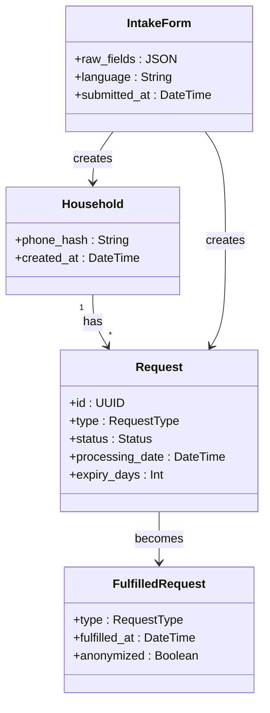
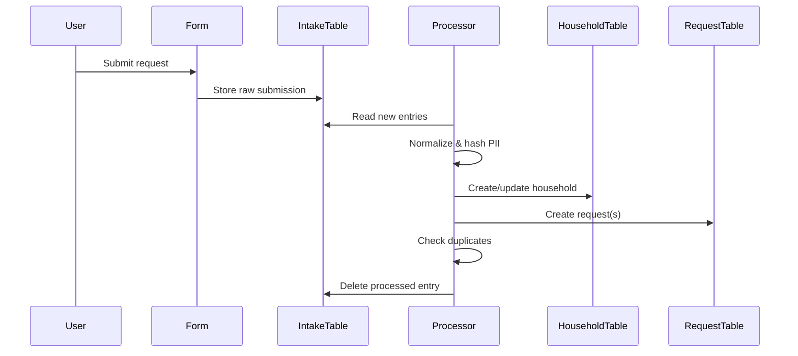
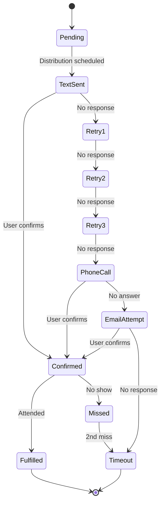

# BAM Mutual Aid System - Technical Specification

## 1. Background

### Problem Statement
Bushwick Ayuda Mutua (BAM) operates a mutual aid system that manages intake requests, distribution events, and volunteer coordination through a combination of Airtable, Digital Ocean functions, and manual processes. The current system has technical debt, relies on manual intervention for key workflows, and needs better data privacy practices.

### Context / History
- Existing system uses Airtable as primary database
- Automation functions hosted on Digital Ocean
- GitHub repo: bushwickayudamutua/bam-automation
- API docs: https://airtable.com/appjIo54Z8MWrqhlI/api/docs

### Stakeholders
- **Recipients**: Community members requesting goods/services
- **Volunteers**: Outreach, check-in, delivery/transport, furniture teams
- **Admins**: System administrators managing distributions and data
- **External Systems**: Dialpad SMS, Airtable, Digital Ocean

---

## 2. Motivation

### Goals & Success Stories

**Recipient Journey:**
1. Submit request form (multi-language)
2. Receive text confirmation
3. Confirm appointment
4. Attend distribution event
5. Check in via phone number/name
6. Receive requested items
7. Re-request if needed

**Volunteer Goals:**
- Efficiently manage distribution outreach (text/phone)
- Check in recipients at events
- Track inventory post-distribution
- Coordinate furniture/delivery logistics

**System Goals:**
- Deduplicate requests automatically
- Maintain data privacy (hash sensitive data)
- Auto-expire stale requests (14 days standard, 30 days pots/pans)
- Track fulfilled vs outstanding requests
- Support 60 appointments per distribution (25% confirmation rate)

---

## 3. Scope and Approaches

### Non-Goals

| Technical Functionality | Reasoning | Tradeoffs |
|------------------------|-----------|-----------|
| Appointments & Distros tables | May be deprecated | Legacy data structure |
| Full automation of volunteer matching | Complex language/availability matching | Manual oversight still needed |
| Real-time inventory management | Informal post-distro reporting works | May miss accuracy |

### Value Proposition

| Technical Functionality | Value | Tradeoffs |
|------------------------|-------|-----------|
| Intake deduplication | Prevents duplicate requests per household | Phone number as unique ID may miss edge cases |
| Request auto-expiration | Keeps queue fresh and relevant | May lose valid long-term requests |
| Hashed PII storage | Privacy protection | Increases friction for address-based deliveries |
| Fulfilled requests anonymization | Data minimization | Loses granular historical data |

### Alternative Approaches

| Approach | Pros | Cons |
|----------|------|------|
| Raw PII storage | Easy lookups, low friction | Privacy risk, compliance issues |
| Full automation | Reduced manual work | Complex edge cases, less flexibility |
| Separate systems per workflow | Isolation, simpler components | Data silos, integration overhead |

### Relevant Metrics
- Fulfilled requests per type/volume
- Outstanding requests count
- Distribution attendance rate (~25% of outreach)
- Average 60 appointments per distribution
- 3 appointment-based distributions per week

---

## 4. Step-by-Step Flows

### 4.1 Intake Processing (Happy Path)

**Pre-condition:** Form submission received in Intake Table

1. **User** submits multi-language conditional intake form
2. **System** validates and stores all fields in Intake Table
3. **System** applies filters and creates Household row
4. **System** creates Request rows per request type
5. **System** applies deduplication logic (phone number key)
6. **System** normalizes data and stores hash of PII
7. **System** deletes Intake Table row
8. **System** schedules auto-expiration (14/30 days)

**Post-condition:** Household and Request records exist; Intake cleared

---

### 4.2 Distribution Outreach Flow (Happy Path)

**Pre-condition:** Distribution scheduled, inventory checked

1. **Admin** creates filtered view matching target population criteria:
   - Available supplies match
   - Language availability at distro
   - Not recently attended
2. **System** (Digital Ocean) processes view via `/send_dialpad_sms`
3. **System** sends text blast with language-specific templates
4. **Recipients** respond to confirm (target: 240 people for 60 appointments)
5. **Volunteer** manually marks confirmations in Airtable
6. **Recipients** attend distribution

**Post-condition:** Appointments confirmed, ready for check-in

---

### 4.3 Check-In Flow (Happy Path)

**Pre-condition:** Recipient confirmed appointment

1. **Recipient** arrives at distribution
2. **Volunteer** performs phone number lookup in Airtable
3. **System** displays recipient's requests
4. **Volunteer** marks requests as fulfilled
5. **Volunteer** directs recipient to pickup area
6. **System** anonymizes and moves to fulfilled requests view

**Post-condition:** Request closed, anonymized record created

---

### 4.4 Alternate / Error Paths

| # | Condition | System Action | Suggested Handling |
|---|-----------|---------------|-------------------|
| A1 | Duplicate phone number | Skip duplicate request | Log and notify admin |
| A2 | Partial fulfillment (out of stock) | Keep request open | Do not mark as fulfilled to prevent deprioritization |
| A3 | No-show at appointment | Mark as missed | Return to queue for next outreach cycle |
| A4 | 1st missed appointment | Continue in queue | Follow outreach flowchart retry logic |
| A5 | 2nd missed appointment | Email if available | Attempt email contact |
| A6 | No response after all attempts | Mark as timeout | Close request |
| A7 | Wrong number | Mark as invalid | Close request |
| A8 | No longer needs goods | Mark complete | Close request |

---

## 5. UML Diagrams

### Entity Relationships

### Intake Processing Sequence

### Outreach State Machine

---

## 6. Edge Cases and Concessions

### Data Privacy
- **Concession**: Addresses stored in plain text for furniture/delivery requests (hashing would break logistics)
- **Edge case**: Multiple households sharing same phone number - may cause deduplication issues
- **Edge case**: Multiple phone numbers per household - may create duplicate households

### Request Expiration
- **Concession**: 14-day window may be too short for some needs
- **Exception**: Pots/pans get 30-day window due to availability constraints

### Outreach
- **Concession**: Text blast targeting is not fully automated - requires manual view creation
- **Edge case**: Language matching between volunteers and recipients is manual

### Fulfillment
- **Design decision**: Partial fulfillment keeps request open to prevent deprioritization
- **Concession**: Post-distro inventory is informal text-based reporting

---

## 7. Open Questions

1. **PII Hashing**: How to handle address obfuscation without breaking delivery/pickup workflows?
2. **Volunteer Access**: What is the access revocation timeline and process?
3. **Furniture Team Flow**: Need detailed workflow from furniture team (currently not taking new requests)
4. **Phone Call Outreach**: Need to research and document single-person phone outreach flow
5. **Admin Flows**: Need to interview admins to document administrative workflows
6. **Cron Jobs**: Review Digital Ocean cron jobs for technical debt assessment

---

## 8. Glossary / References

### Terms
- **BAM** - Bushwick Ayuda Mutua
- **Distro** - Distribution event where recipients pick up goods
- **Intake** - Initial request submission from community members
- **Text Blast** - Automated SMS outreach to target population
- **Timeout** - Request closed due to no response after all contact attempts

### Request Types
- Diapers (sizes 1-6)
- Pads/Tampons/Panty liners
- Soap
- School supplies
- Masks/COVID tests
- Kitchen supplies
- Furniture (separate flow)
- Pots and pans (30-day expiry)

### Links
- Airtable API: https://airtable.com/appjIo54Z8MWrqhlI/api/docs
- Automation repo: https://github.com/bushwickayudamutua/bam-automation
- Entry point: `functions/project.yml`
- SMS endpoint: `/send_dialpad_sms`
